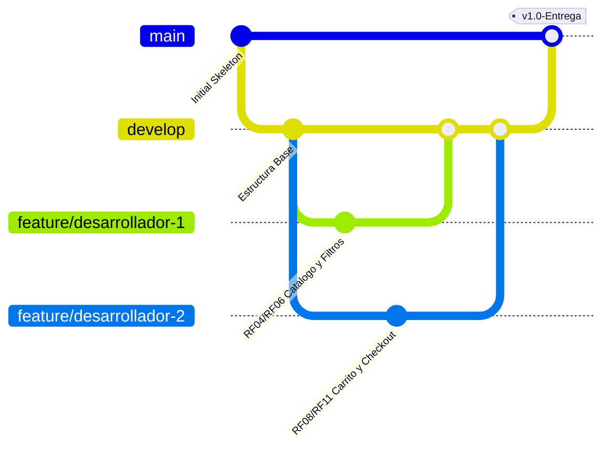

# Guía de Inicio y Manual de Trabajo en Equipo (Git Flow)

## Proyecto: Tienda en Línea de Electrodomésticos y Línea Blanca
- **Versión**: 1.0 (Esqueleto & Arquitectura Base)
- **Fecha de Entrega**: 25 de Septiembre 2026
- **Base de Datos**: MySQL 8.0 (InnoDB) normalizada sin `ENUM`
- **Frontend**: HTML5, Vanilla CSS / Bootstrap 5.3, Bootstrap Icons, Google Fonts (Plus Jakarta Sans & Outfit)
- **Backend**: PHP 8.2 (MVC Ligero + PDO)

---

## 1. Requisitos Previos y Entorno de Desarrollo

Para levantar el proyecto localmente, cada integrante del equipo puede optar por:
1. **Opción A (Recomendada - Docker)**:
   - Contenedor MySQL (`mysql_database` en puerto `3308`) y contenedor PHP Apache (`php_backend_api` en puerto `8000`).
2. **Opción B (XAMPP / Servidor Local)**:
   - Apache + MySQL activos en XAMPP.
   - Importar `database/schema.sql` y luego `database/seeds.sql` en su MySQL local.

---

## 2. Configuración Inicial Paso a Paso

### Paso 1: Clonar y Preparar Variables de Entorno (.env)
Cada desarrollador debe copiar la plantilla de variables de entorno y ajustarla a su configuración local:
```bash
cp .env.example .env
```

Edite el archivo `.env`:
- Si usa Docker:
  ```ini
  DB_HOST=database
  DB_PORT=3306
  DB_NAME=tienda_electrodomesticos
  DB_USER=root
  DB_PASS=root_password
  ```
- Si usa XAMPP localmente:
  ```ini
  DB_HOST=127.0.0.1
  DB_PORT=3308   # O 3306 según la configuración de su MySQL
  DB_NAME=tienda_electrodomesticos
  DB_USER=root
  DB_PASS=su_password
  ```

### Paso 2: Ejecutar Scripts de Base de Datos
- **Paso 2.1**: Ejecutar `database/schema.sql` (crea las 13 tablas relacionales 3FN).
- **Paso 2.2**: Ejecutar `database/seeds.sql` (inserta roles, marcas Samsung/LG/Whirlpool/Mabe, categorías, productos iniciales y usuarios demo).

### Paso 3: Probar la Conexión a la Base de Datos
Abra en el navegador o realice una petición HTTP GET al endpoint de prueba:
```
http://localhost:8000/Proyecto_Tienda_online/api/test_db.php
```
Debe recibir un JSON con `"database_status": "ONLINE"` y `"acid_support": {"test_result": "OK"}`.

### Credenciales de Prueba Creadas en Seeds:
- **Administrador**: `admin@electrotienda.com` / `admin123`
- **Cliente**: `maria.cliente@gmail.com` / `cliente123`

---

## 3. Metodología de Trabajo en Equipo: Git Flow

Para evitar conflictos de código entre los integrantes del equipo:



### Reglas de Ramas:
1. **`main`**: Rama de producción. Solo contiene código 100% probado y funcional.
2. **`develop`**: Rama integradora. Aquí se unen las funcionalidades terminadas.
3. **`feature/desarrollador-1`** y **`feature/desarrollador-2`**: Ramas de trabajo individual para cada módulo.

### Flujo de Trabajo Diario:
1. Siempre actualizar `develop` antes de iniciar:
   ```bash
   git checkout develop
   git pull origin develop
   ```
2. Crear su rama de funcionalidad desde `develop`:
   ```bash
   git checkout -b feature/nombre-de-la-tarea
   ```
3. Trabajar, hacer commits claros y concisos:
   ```bash
   git add .
   git commit -m "feat(catalogo): implementar filtros por marca y categoria"
   ```
4. Subir la rama a GitHub y crear un Pull Request hacia `develop`.

---

## 4. Distribución de Tareas del Product Backlog

| Módulo | Requerimientos | Encargado Sugerido | Archivos Clave |
|---|---|---|---|
| **Autenticación & Usuarios** | RF01, RF02, RF03, RF18 | Desarrollador 1 | `Usuario.php`, `AuthController.php`, `login.php`, `registro.php` |
| **Catálogo & Búsqueda** | RF04, RF05, RF06, RF07 | Desarrollador 1 | `Producto.php`, `ProductoController.php`, `catalogo.php`, `catalogo.js` |
| **Carrito & Checkout (ACID)** | RF08, RF09, RF10, RF11, RF13 | Desarrollador 2 | `Pedido.php`, `CarritoController.php`, `PedidoController.php`, `carrito.php` |
| **Wishlist & Reseñas** | RF14, RF15 | Desarrollador 2 | `Resena.php`, `Wishlist.php`, `wishlist.php`, `producto_detalle.php` |
| **Panel de Administración** | RF16, RF17, RF18 | Ambos | `views/admin/`, `AdminController.php`, `admin.js` |

---

## 5. Reglas de Código Limpio y Calidad (Clean Code)
1. **Nombres Significativos**: Métodos y variables deben expresar intención clara (ej. `obtenerProductosPorCategoria()` en lugar de `get_data()`).
2. **Funciones Pequeñas y de Responsabilidad Única (SRP)**: Cada función hace una sola cosa bien.
3. **Cero Emojis**: Prohibido usar emojis en código, comentarios y vistas. Usar iconos de Bootstrap (`<i class="bi bi-cart"></i>`).
4. **Comentarios Concisos**: Solo documentar la intención del bloque donde aporte contexto clave.
5. **Transacciones ACID**: Siempre envolver modificaciones de pedidos e inventario en bloques transaccionales con `try / catch`.
