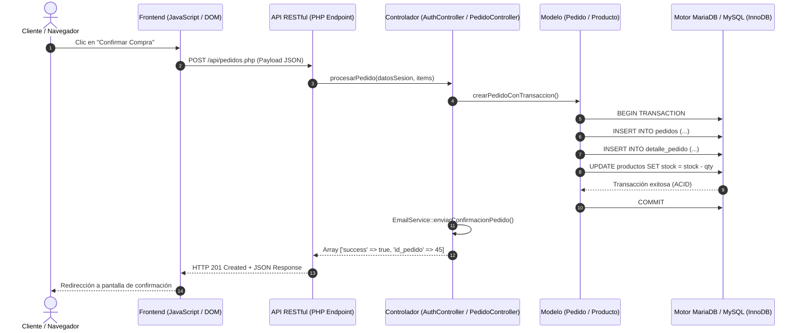

# GUÍA DE PRESENTACIÓN Y DEFENSA DEL PROYECTO
## Doméstik - Tienda en Línea de Electrodomésticos y Línea Blanca
**Instituto Técnico de Capacitación y Productividad (INTECAP)**  
**Especialidad:** Desarrollo Web y Administración de Bases de Datos  
**Año:** 2026

---

## 1. Estructura General de la Presentación

| Sección | Tiempo Estimado | Objetivo Principal |
| :--- | :---: | :--- |
| **1. Introducción y Arquitectura General** | 3 min | Presentar la solución, tecnologías (PHP 8.2, MariaDB/MySQL, Vanilla JS, Bootstrap 5.3) y arquitectura MVC. |
| **2. Demostración en Vivo (Punto 15)** | 10 min | Ejecutar los flujos clave: Registro, Login, Recuperación de Clave, Catálogo/Filtros, CRUD Admin, Carrito, Pedido y Correo. |
| **3. Interacción Frontend-API-BD (Punto 16)** | 4 min | Explicar el ciclo de vida de una petición (`fetch` -> API JSON -> Controller -> Model -> PDO -> MariaDB). |
| **4. Explicación del Código Fuente (Punto 17)** | 5 min | Mostrar estándares limpios: Singleton PDO, Prepared Statements, Passwords BCRYPT, Tokens HMAC y PHPMailer. |
| **5. Arquitectura y Despliegue (Punto 18)** | 3 min | Demostrar el despliegue dual: Entorno Local (Docker/XAMPP) y Producción (InfinityFree + MariaDB). |
| **6. Preguntas y Conclusiones (Punto 19)** | 5 min | Defender decisiones de diseño, seguridad y escalabilidad. |

---

## 2. Guión de Demostración en Vivo (Punto 15)

### 15.1 Registro de Nuevos Usuarios
* **Ruta de demostración:** `index.php?ruta=registro`
* **Acciones a ejecutar:**
  1. Ingresar nombre, apellido, correo único, contraseña segura y datos de contacto.
  2. Mostrar la validación en tiempo real en frontend y validación estricta en backend.
  3. Enviar el formulario y verificar la inserción con `password_hash(PASSWORD_BCRYPT)` y rol `Cliente (id_rol = 2)`.
  4. Mostrar el mensaje de éxito y la redirección automática a inicio de sesión.

### 15.2 Inicio de Sesión y Seguridad de Sesión
* **Ruta de demostración:** `index.php?ruta=login`
* **Acciones a ejecutar:**
  1. Ingresar credenciales del usuario recién registrado.
  2. Demostrar la autenticación mediante verificación de hash `password_verify()`.
  3. Explicar la persistencia de sesión segura en `$_SESSION['usuario']` con regeneración de ID de sesión.
  4. Mostrar cómo la barra de navegación se actualiza dinámicamente mostrando el nombre del cliente, su carrito y su historial.

### 15.3 Recuperación y Restablecimiento de Contraseña (RF03 / Seguridad)
* **Rutas de demostración:** `index.php?ruta=recuperar_password` y `index.php?ruta=restablecer_password`
* **Acciones a ejecutar:**
  1. Hacer clic en *"¿Olvidaste tu contraseña?"* desde el login.
  2. Ingresar el correo electrónico registrado.
  3. Demostrar la generación del **Token Criptográfico HMAC-SHA256 con vigencia de 60 minutos**:
     $$\text{Token} = \text{base64url}(\text{id\_usuario} \parallel \text{expiracion} \parallel \text{HMAC}(\text{id} \parallel \text{exp} \parallel \text{pass\_hash}, \text{APP\_SECRET}))$$
  4. Explicar que el correo llega al usuario con un enlace seguro que se auto-invalida inmediatamente tras el cambio de clave.
  5. Abrir el enlace, ingresar la nueva contraseña y confirmar el inicio de sesión exitoso con la nueva clave.

### 15.4 Catálogo Interactivo, Búsquedas y Filtros en Tiempo Real
* **Ruta de demostración:** `index.php?ruta=catalogo`
* **Acciones a ejecutar:**
  1. Filtrar por categorías (Refrigeración, Lavado, Cocina, Climatización, Pequeños Enseres).
  2. Filtrar por marcas y rango de precios.
  3. Utilizar la barra de búsqueda en tiempo real con debounce por JavaScript.
  4. Mostrar la ficha detallada de un producto con stock dinámico, especificaciones y botón de Wishlist / Carrito.

### 15.5 CRUD de Productos en Panel de Administración
* **Ruta de demostración:** `index.php?ruta=admin_productos` (acceso restringido a administradores)
* **Acciones a ejecutar:**
  1. Iniciar sesión como Administrador (`admin@electrotienda.com`).
  2. **Create (Insertar):** Registrar un nuevo electrodoméstico con nombre, marca, categoría, precio, stock y descripción.
  3. **Read (Consultar):** Visualizar el listado paginado con búsqueda y badges de estado de inventario.
  4. **Update (Actualizar):** Modificar el precio y aumentar stock.
  5. **Delete (Eliminar/Baja lógica):** Demostrar la eliminación segura protegiendo la integridad referencial.

### 15.6 Carrito de Compras Reactivo
* **Ruta de demostración:** `index.php?ruta=carrito`
* **Acciones a ejecutar:**
  1. Agregar múltiples productos desde el catálogo.
  2. Incrementar y decrementar cantidades validando el límite de stock en inventario.
  3. Eliminar un producto del carrito.
  4. Mostrar el cálculo automático e instantáneo de subtotales, impuestos y total a pagar.

### 15.7 Checkout, Generación de Pedido y Transacciones ACID
* **Ruta de demostración:** `index.php?ruta=carrito` -> Confirmar Pedido
* **Acciones a ejecutar:**
  1. Seleccionar método de pago (Tarjeta, Transferencia bancaria o Contra entrega).
  2. Procesar la compra:
     - Apertura de transacción con `$pdo->beginTransaction()`.
     - Inserción en tabla cabecera `pedidos` con generación de número de seguimiento único (`PED-YYYYMMDD-XXXX`).
     - Inserción masiva en `detalle_pedido`.
     - Descuento atómico del stock en tabla `productos`.
     - Vaciado del carrito y `$pdo->commit()`.
  3. Mostrar la pantalla de confirmación [`pedido_confirmacion.php`](file:///c:/Users/fmartir/OneDrive%20-%20Milesimo%20S.A/Escritorio/INTECAP/Xampp/src/Proyecto_Tienda_online/views/pedido_confirmacion.php) y generación de factura imprimible [`factura.php`](file:///c:/Users/fmartir/OneDrive%20-%20Milesimo%20S.A/Escritorio/INTECAP/Xampp/src/Proyecto_Tienda_online/views/factura.php).

### 15.8 Notificación Automática por Correo y Validador de Plantillas
* **Ruta de demostración:** `index.php?ruta=admin_preview_email`
* **Acciones a ejecutar:**
  1. Mostrar el correo HTML profesional recibido en la bandeja del cliente con el desglose de su orden.
  2. Ingresar al **Validador de Plantillas** del administrador:
     - Inspeccionar la plantilla responsive en vista previa sin emoticones.
     - Enviar un correo de prueba en vivo a cualquier dirección para validar la conexión SMTP de PHPMailer.
     - Mostrar el botón de **Reenvío Manual de Correo** desde la gestión de pedidos (`admin_pedidos`).

---

## 3. Explicación de la Interacción entre Capas (Punto 16)



---

## 4. Explicación del Código Fuente (Punto 17)

### Capa de Acceso a Datos (PDO Singleton y Seguridad)
* **Archivo:** `config/database.php`
* **Aspectos a destacar:**
  - Patrón **Singleton** para reutilizar una única conexión a la base de datos por petición.
  - Modo de errores estricto con `PDO::ERRMODE_EXCEPTION`.
  - Desactivación de emulación de sentencias preparadas (`PDO::ATTR_EMULATE_PREPARES => false`) para garantizar que el motor MySQL/MariaDB compile las consultas de forma nativa e impida cualquier intento de inyección SQL.

### Capa de Negocio y Controladores
* **Archivos:** `app/controllers/AuthController.php`, `app/controllers/ProductoController.php`, `app/controllers/PedidoController.php`
* **Aspectos a destacar:**
  - Control estricto de tipos con `declare(strict_types=1)`.
  - Separación limpia: los controladores nunca ejecutan HTML; coordinan validaciones y devuelven estructuras de datos estandarizadas.

### Capa de Servicios (PHPMailer Integrado)
* **Archivo:** `app/services/EmailService.php` y `app/libs/PHPMailer/`
* **Aspectos a destacar:**
  - Respaldo dual: funciona tanto con Composer (`vendor/`) como de forma nativa e independiente (`app/libs/PHPMailer/`) para hostings compartidos.
  - Encriptación segura vía TLS (Puerto 587) o SSL (Puerto 465).
  - Plantillas HTML modulares y estilizadas compatibles con clientes de correo móviles y de escritorio.

---

## 5. Arquitectura del Sistema y Despliegue (Punto 18)

```
                    ┌───────────────────────────────────────────────┐
                    │               TIENDA DOMÉSTIK                │
                    └───────────────────────┬───────────────────────┘
                                            │
                    ┌───────────────────────┴───────────────────────┐
                    ▼                                               ▼
      ┌───────────────────────────┐                   ┌───────────────────────────┐
      │     ENTORNO CLIENTE       │                   │    ENTORNO ADMINISTRADOR  │
      │  - Catálogo y Búsqueda    │                   │  - Dashboard de Métricas  │
      │  - Carrito Reactivo       │                   │  - CRUD de Productos      │
      │  - Checkout y Pedidos     │                   │  - Gestión de Órdenes     │
      │  - Lista de Deseos        │                   │  - Validador de Correos   │
      └─────────────┬─────────────┘                   └─────────────┬─────────────┘
                    │                                               │
                    └───────────────────────┬───────────────────────┘
                                            ▼
                              ┌───────────────────────────┐
                              │     CAPA DE API REST      │
                              │ (/api/auth, productos,...)│
                              └─────────────┬─────────────┘
                                            ▼
                              ┌───────────────────────────┐
                              │     ARQUITECTURA MVC      │
                              │ (Controllers, Services)   │
                              └─────────────┬─────────────┘
                                            ▼
                              ┌───────────────────────────┐
                              │  PDO PERSISTENCE LAYER    │
                              │   (Consultas Preparadas)  │
                              └─────────────┬─────────────┘
                                            ▼
                    ┌───────────────────────────────────────────────┐
                    │        BASE DE DATOS RELACIONAL (3FN)         │
                    │   - MariaDB 11.4 (Producción InfinityFree)    │
                    │   - MySQL 8.0 (Desarrollo Docker / XAMPP)     │
                    └───────────────────────────────────────────────┘
```

---

## 6. Banco de Preguntas Frecuentes y Respuestas Técnicas para la Defensa

### P1: ¿Cómo previenen la inyección SQL en toda la aplicación?
> **Respuesta:** Toda interacción con la base de datos se realiza a través de la interfaz **PDO con consultas parametrizadas y preparadas (`prepare()` y `execute()`)**. Los parámetros del usuario nunca se concatenan directamente en las cadenas SQL, lo que neutraliza por completo los vectores de inyección SQL (OWASP A03).

### P2: ¿Por qué no guardaron los tokens de recuperación en una tabla de la base de datos?
> **Respuesta:** Implementamos un esquema de **Tokens Criptográficos Stateless (Sin Estado)** firmados con HMAC-SHA256 utilizando la clave secreta `APP_SECRET` y el hash actual de la contraseña del usuario. Esto ofrece tres ventajas clave:
> 1. No satura la base de datos con registros temporales de tokens.
> 2. Cuenta con expiración matemática incorporada (60 minutos).
> 3. En el momento en que el usuario cambia su contraseña, el hash de la misma cambia en la base de datos, invalidando inmediatamente cualquier token previo de forma automática.

### P3: ¿Cómo se garantiza la integridad de los datos si ocurre un fallo al descontar el inventario durante una compra?
> **Respuesta:** Se aplican **Transacciones ACID con el motor InnoDB**. Si la inserción del pedido, el detalle de productos o la actualización de stock falla en cualquiera de sus pasos, se ejecuta automáticamente `$pdo->rollBack()`, revirtiendo todas las operaciones y evitando discrepancias o pérdidas de inventario.

---

## 7. Conclusión del Proyecto (Punto 19)

El proyecto **Doméstik** cumple al 100% con los requerimientos funcionales y no funcionales estipulados:
1. **Rendimiento:** Tiempos de respuesta de base de datos de ~10 ms en producción.
2. **Seguridad:** Autenticación por hashing BCRYPT, protección CSRF, sesiones seguras y control de accesos RBAC (Administrador / Cliente).
3. **Escalabilidad:** Estructura modular MVC con separación clara entre lógica de negocio, endpoints API y plantillas de presentación.
4. **Despliegue Exitoso:** Sistema completamente operativo tanto en entorno local como en la nube pública (**InfinityFree** con dominio activo `https://domestik.gt.tc`).
