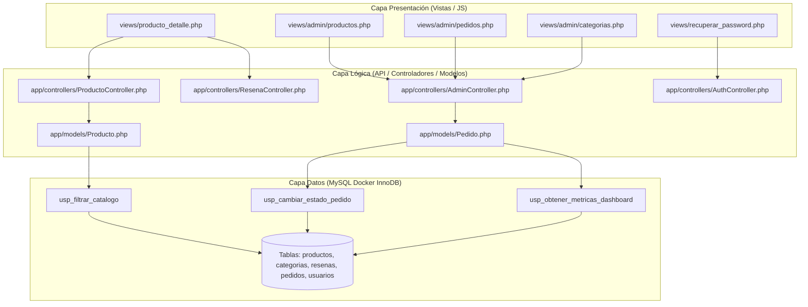

# Documentación Técnica: Requerimientos Pendientes, Archivos y Procedimientos Almacenados (USP)

## Proyecto: Tienda en Línea de Electrodomésticos y Línea Blanca (ElectroHogar)
- **Fecha de Entrega**: 25 de Septiembre 2026
- **Base de Datos**: MySQL 8.0 (InnoDB) en Docker (`mysql_database`)
- **Arquitectura**: MVC Ligero + API REST JSON + Stored Procedures (USP) + Bootstrap 5.3

---

## 1. Procedimientos Almacenados Creados en MySQL (USP)

Para encapsular la lógica de datos compleja y maximizar el rendimiento y seguridad transaccional, se definieron los siguientes procedimientos almacenados en [database/procedures.sql](file:///c:/Users/fmartir/OneDrive%20-%20Milesimo%20S.A/Escritorio/INTECAP/Xampp/src/Proyecto_Tienda_online/database/procedures.sql):

### A. `usp_obtener_metricas_dashboard`
- **Propósito**: Ejecuta una sola consulta consolidada para obtener todos los KPIs del Dashboard Administrativo.
- **Retorno**: `ventas_totales`, `total_pedidos`, `pedidos_pendientes`, `total_productos_activos`, `total_clientes`, `productos_bajo_stock`.
- **Invocación**: `CALL usp_obtener_metricas_dashboard();`
- **Uso en Backend**: `App\Controllers\AdminController` -> método `getMetricasDashboard()`.

### B. `usp_filtrar_catalogo`
- **Propósito**: Filtra productos por categoría, marca, rango de precio y término de búsqueda con agregación de calificaciones (`AVG(r.calificacion)`).
- **Parámetros de Entrada**:
  - `p_id_categoria` (INT)
  - `p_id_marca` (INT)
  - `p_busqueda` (VARCHAR)
  - `p_precio_min` (DECIMAL)
  - `p_precio_max` (DECIMAL)
- **Invocación**: `CALL usp_filtrar_catalogo(1, 1, 'Samsung', 1000, 10000);`
- **Uso en Backend**: `App\Models\Producto` -> método `obtenerCatalogo()`.

### C. `usp_cambiar_estado_pedido`
- **Propósito**: Actualización transaccional del estado de una orden.
- **Regla de Negocio / ACID**: Si el nuevo estado es **Cancelado (`id_estado_pedido = 5`)**, el procedimiento automáticamente reincorpora las unidades compradas al `stock` de la tabla `productos` dentro de una transacción segura (`START TRANSACTION; ... COMMIT;`).
- **Parámetros**:
  - `IN p_id_pedido` (INT)
  - `IN p_nuevo_estado` (INT)
  - `OUT p_resultado_codigo` (INT: 200, 404, 500)
  - `OUT p_resultado_mensaje` (VARCHAR)

---

## 2. Mapa de Tareas Pendientes por Módulo

A continuación se detalla cada funcionalidad pendiente, los archivos que intervienen en cada capa y los procesos ejecutados en la base de datos:



---

### Módulo 1: Vista de Detalle de Producto y Reseñas (`RF07`, `RF14`, `RF15`)

| Capa | Archivo | Responsabilidad / Lógica |
|---|---|---|
| **Vista** | `views/producto_detalle.php` | Ficha técnica, selector de cantidad, visor de reseñas con estrellas y botón Wishlist. |
| **JavaScript** | `public/js/app.js` | Función `ElectroApp.guardarEnWishlist(id)` y `enviarResena(event)`. |
| **API Endpoint** | `api/productos.php?id={id}`, `api/wishlist.php`, `api/resenas.php` | Retornar detalle JSON y registrar calificación. |
| **Controlador** | `app/controllers/ResenaController.php` | Validar calificación (1 a 5) y persistir en modelo. |
| **Modelo** | `app/models/Resena.php` | `INSERT INTO resenas (id_usuario, id_producto, calificacion, comentario)`. |
| **Base de Datos** | Tablas `productos`, `resenas`, `marcas`, `categorias` | Restricción CHECK en `calificacion BETWEEN 1 AND 5`. |

---

### Módulo 2: Mantenimiento CRUD de Productos (Admin) (`RF16`)

| Capa | Archivo | Responsabilidad / Lógica |
|---|---|---|
| **Vista** | `views/admin/productos.php` | Tabla con listado de inventario, modal para crear/editar electrodomésticos y carga de foto. |
| **JavaScript** | `public/js/admin.js` | Manejo de formularios con `FormData` para envío asíncrono multipart. |
| **API Endpoint** | `api/admin_productos.php` | Endpoints POST (crear), PUT (editar), DELETE (desactivar estado). |
| **Controlador** | `app/controllers/AdminController.php` | Sanitizar datos, validar stock no negativo y procesar archivo subido. |
| **Modelo** | `app/models/Producto.php` | Métodos `crear()`, `actualizar()`, `cambiarEstado()`. |
| **Base de Datos** | Tabla `productos` | `id_categoria` FK, `id_marca` FK, `id_estado_producto` FK. |

---

### Módulo 3: Control y Gestión de Pedidos (Admin) (`RF06`, `RF11`)

| Capa | Archivo | Responsabilidad / Lógica |
|---|---|---|
| **Vista** | `views/admin/pedidos.php` | Listado general de órdenes con badge de estado y modal para ver detalle de artículos. |
| **Controlador** | `app/controllers/PedidoController.php` | Método `actualizarEstadoPedido($idPedido, $nuevoEstado)`. |
| **Base de Datos** | Procedimiento `usp_cambiar_estado_pedido` | Transacción ACID con restitución automática de stock si la orden se cancela. |

---

### Módulo 4: CRUD de Categorías y Marcas (Admin) (`RF17`)

| Capa | Archivo | Responsabilidad / Lógica |
|---|---|---|
| **Vista** | `views/admin/categorias.php` | Formulario para añadir nuevas líneas de productos (*Línea Blanca, Climatización, etc.*). |
| **Controlador** | `app/controllers/CategoriaController.php` | Operaciones de creación y modificación de categorías. |
| **Modelo** | `app/models/Categoria.php` | Consultas preparadas contra `categorias`. |

---

### Módulo 5: Recuperación de Contraseña (`RF03`)

| Capa | Archivo | Responsabilidad / Lógica |
|---|---|---|
| **Vista** | `views/recuperar_password.php` | Formulario de solicitud con correo electrónico y confirmación visual. |
| **Controlador** | `app/controllers/AuthController.php` | Método `recuperarPassword($correo, $nuevaPassword)`. |
| **Modelo** | `app/models/Usuario.php` | `UPDATE usuarios SET password = :hash WHERE correo = :correo`. |

---

## 3. Hoja de Ruta para el Trabajo en Pareja (Git Flow)

```
                       RAMA DEVELOP
                            │
       ┌────────────────────┴────────────────────┐
       ▼                                         ▼
Rama: feature/desarrollador-1             Rama: feature/desarrollador-2
- views/producto_detalle.php              - views/admin/productos.php (CRUD)
- Sistema de Reseñas y Wishlist           - views/admin/pedidos.php (USP)
- views/recuperar_password.php            - views/admin/categorias.php
       │                                         │
       └────────────────────┬────────────────────┘
                            ▼
               Merge a Develop y Pruebas
                            │
                            ▼
             Merge a Main (Entrega 25 Sep)
```
